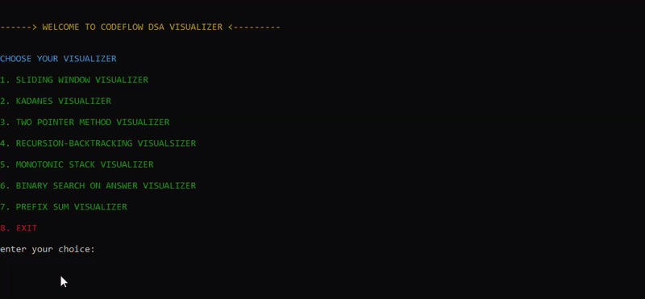

#  DSA Visualizer

A cross-platform, user interactive **Data Structures & Algorithms Visualizer** built in C++. Designed to simulate and explain core DSA concepts using real-time terminal animations and ANSI styling.

✅ Cross-platform: Works on Windows 10+, Linux, and macOS terminals  
✅ Zero dependencies: No external libraries used  
✅ Real-time visualizations: ANSI-based animations  
✅ Modular design: Each algorithm in its own folder with clean separation
✅ User-interactive : for better understanding


#  Algorithms Implemented
- Kadane’s Algorithm  
- Sliding Window Technique  
- Two Pointer Technique  
- Prefix Sum  
- Monotonic Stack  
- Binary Search on Answer  
- Recursion + Backtracking

Each algorithm is implemented in its own file and folder with terminal-based step-by-step simulation.

### 🛠 Requirements
- C++ compiler (`g++`, `MinGW`, `TDM-GCC`, etc.)
- Any terminal: CMD, PowerShell, VS Code Terminal, Linux/macOS Terminal
- Operating System: Windows 10+, Linux, or macOS
### 🚀 How to Run the Project

Clone the repository:
```bash
git clone https://github.com/goutham-120/DSA-Visualizer.git
cd DSA-Visualizer

### If you're using Visual Studio Code:

Make sure the C/C++ extension is installed.

Open the folder DSA-Visualizer in VS Code.

Press Ctrl + Shift + B to build the project using the tasks.json config.

Press F5 to run the project using launch.json.

The output will appear in a seperate console window (external terminal) with full color and animation support.


### If you're using a terminal manually:

Compile all the source files together:

g++ Main.cpp \
kadane/kadane.cpp \
sliding_window/sliding_window.cpp \
two_pointer/two_pointer.cpp \
prefix_sum/prefix_sum.cpp \
Monotonic_Stack/monotonic_stack.cpp \
binary_search_on_answer/binary_search.cpp \
recursion_and_backtracking/recursion_backtracking.cpp \
-o dsa_visualizer

Then run the program:

./dsa_visualizer        # On Linux/macOS
dsa_visualizer.exe      # On Windows (or just type: dsa_visualizer)

All interaction happens directly in the terminal with smooth step-by-step visuals, colored output, and keyboard-driven control.
```
##  Why This Project?

I wanted to combine my interest in Data Structures and Algorithms with a hands-on C++ project that pushes beyond standard problem-solving. My goal was to build something interactive, useful for learners, and technically challenging — all inside the terminal.


##  About This Project

This is my first complete **Real-time user-interactive DSA visualizer** project in C++ using terminal UI and ANSI control. It was built entirely without external libraries or frameworks. The project uses ANSI escape sequences to control output, handle animations, clear screens, and simulate DSA step-by-step — all in real time and cross-platform.

The code is modular, with each algorithm in its own folder, making it easy to extend and maintain.


## Demo

